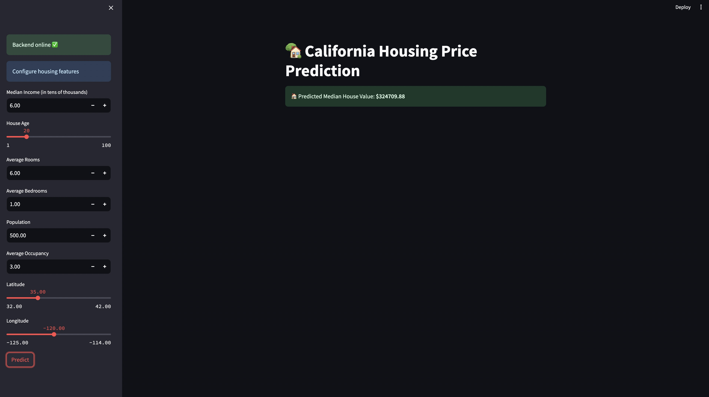

# Streamlit Interface for California Housing Prediction API  

This folder demonstrates how to build an **interactive Streamlit app** that connects to the **FastAPI service** for predicting median house values using the **California Housing dataset**.  

The Streamlit app provides a simple form for entering housing data, sends the input to the FastAPI backend, and displays the predicted **median house value**.  

---

