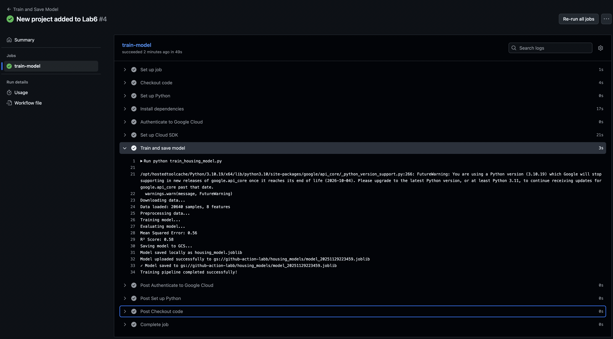

# Housing Price Prediction ML Pipeline

## Overview

An automated machine learning pipeline that trains a housing price prediction model using the California Housing dataset and stores it in Google Cloud Storage. The pipeline runs automatically via GitHub Actions whenever code is pushed to the main branch.

## What It Does

- Downloads and preprocesses the California Housing dataset
- Trains a Linear Regression model to predict house prices
- Evaluates model performance with MSE and R² metrics
- Saves trained models to Google Cloud Storage with timestamps
- Runs automatically on every push to main branch

## Key Features

**Automated Training**: GitHub Actions triggers the pipeline on every code push without manual intervention.

**Cloud Storage**: Models are stored in GCS with unique timestamps for version tracking.

**Containerization**: Docker ensures consistent execution across environments.

**Reproducibility**: All dependencies and configurations are version-controlled.

## How It Works

1. Push code to main branch triggers GitHub Actions workflow
2. Virtual machine sets up Python environment and installs dependencies
3. Authenticates with GCP using service account credentials
4. Downloads data, trains model, and evaluates performance
5. Uploads trained model to GCS with timestamp (e.g., `model_20231129143022.joblib`)

## Model Storage

Each training run creates a new model file in GCS:
- Location: `gs://your-bucket/housing_models/`
- Format: `model_YYYYMMDDHHMMSS.joblib`
- Enables tracking, comparison, and rollback capabilities

## Monitoring

- View workflow runs in GitHub Actions tab with detailed logs
- Check GCS bucket in Google Cloud Console for uploaded models
- Common issues: verify secrets, bucket access, and service account permissions

## Visual Overview

### Workflow Execution

### Model Storage in GCS
.png)

This pipeline demonstrates MLOps best practices: automation, reproducibility, and cloud integration for machine learning workflows.
