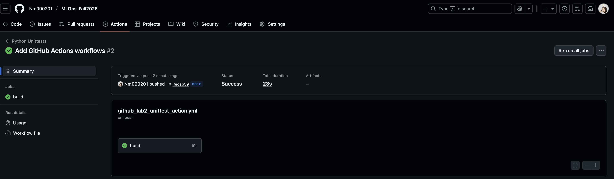

# Spam Detection System

## Overview
This project implements a machine learning-based spam detection system that automatically classifies messages as spam or legitimate (ham). The system uses natural language processing and machine learning algorithms to identify patterns in text that are commonly associated with spam messages.

## Problem Statement
Email and message spam is a persistent problem that wastes time, clutters inboxes, and can pose security risks. Manual filtering is impractical given the volume of messages people receive daily. This project addresses this challenge by building an automated spam classification system.

## Dataset
The system is trained on a collection of pre-labeled messages containing both spam and legitimate communications. The dataset includes various types of messages such as emails, SMS texts, and other written communications. Each message is labeled as either spam or ham to enable supervised learning.

## Model Evaluation
The trained models are evaluated on a separate test dataset to measure their performance on unseen data. Key metrics include:
- **Accuracy**: Overall percentage of correct classifications
- **Precision**: Percentage of messages classified as spam that are actually spam
- **Recall**: Percentage of actual spam messages correctly identified
- **F1-Score**: Harmonic mean of precision and recall
- **Confusion Matrix**: Detailed breakdown of true/false positives and negatives

## Key Features
- Automated text preprocessing pipeline
- Multiple machine learning models for comparison
- Cross-validation to ensure model reliability
- Performance visualization and comparison
- Model persistence for deployment
- Real-time spam classification capability

## Technology Stack
The project utilizes popular Python libraries for data science and machine learning, including tools for data manipulation, natural language processing, machine learning model development, and visualization of results.

## Model Deployment
Once trained and validated, the model can be saved and deployed in production environments. Users can input new messages, and the system will instantly classify them as spam or legitimate based on learned patterns.
