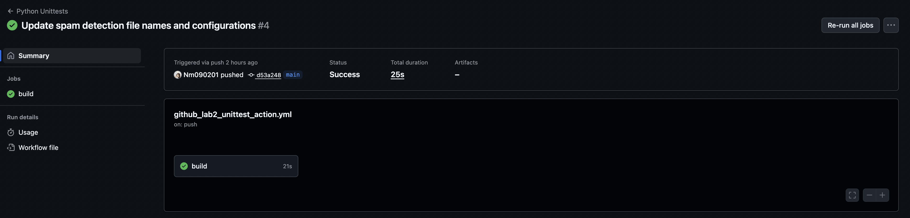

# String Manipulation Testing Project

## Overview
This project demonstrates automated testing and continuous integration (CI/CD) for a simple Python string manipulation utility. The project includes multiple testing frameworks and automated workflows to ensure code quality.

## Project Structure
The project contains a string utilities module with four main functions:
- **Function 1**: Converts text to uppercase
- **Function 2**: Reverses a string
- **Function 3**: Counts character occurrences in text
- **Function 4**: Concatenates two strings with a customizable separator

All functions include input validation and raise appropriate errors for invalid inputs.

## Testing Approach
This project implements comprehensive unit testing using two different Python testing frameworks:

### Pytest Framework
- Modern, pythonic testing approach
- Simple assertion syntax
- Minimal boilerplate code
- Easy to read and write tests

### Unittest Framework
- Python's built-in testing framework
- Class-based test structure
- More verbose but no external dependencies
- Traditional approach inspired by JUnit

## Continuous Integration with GitHub Actions
The project includes two automated CI/CD workflows that run automatically on code changes:

### Pytest Workflow
Triggers on pushes to main and release branches, label creation, and issue events. The workflow sets up a Python environment, installs dependencies, runs pytest tests, generates XML reports, and uploads test results as artifacts.

### Unittest Workflow
Triggers on pushes to the main branch. Similar setup process but uses Python's unittest framework for test execution.

## Key Learning Outcomes
- Understanding different testing frameworks and their philosophies
- Implementing comprehensive unit tests with error handling
- Setting up automated CI/CD pipelines with GitHub Actions
- Generating and managing test reports
- Maintaining code quality through automated testing

## Workflow Triggers
The automated tests run when:
- Code is pushed to specified branches
- Pull requests are created
- Issues are opened or labeled
- Labels are created on the repository

This ensures that all code changes are automatically validated before being merged into the main codebase.
